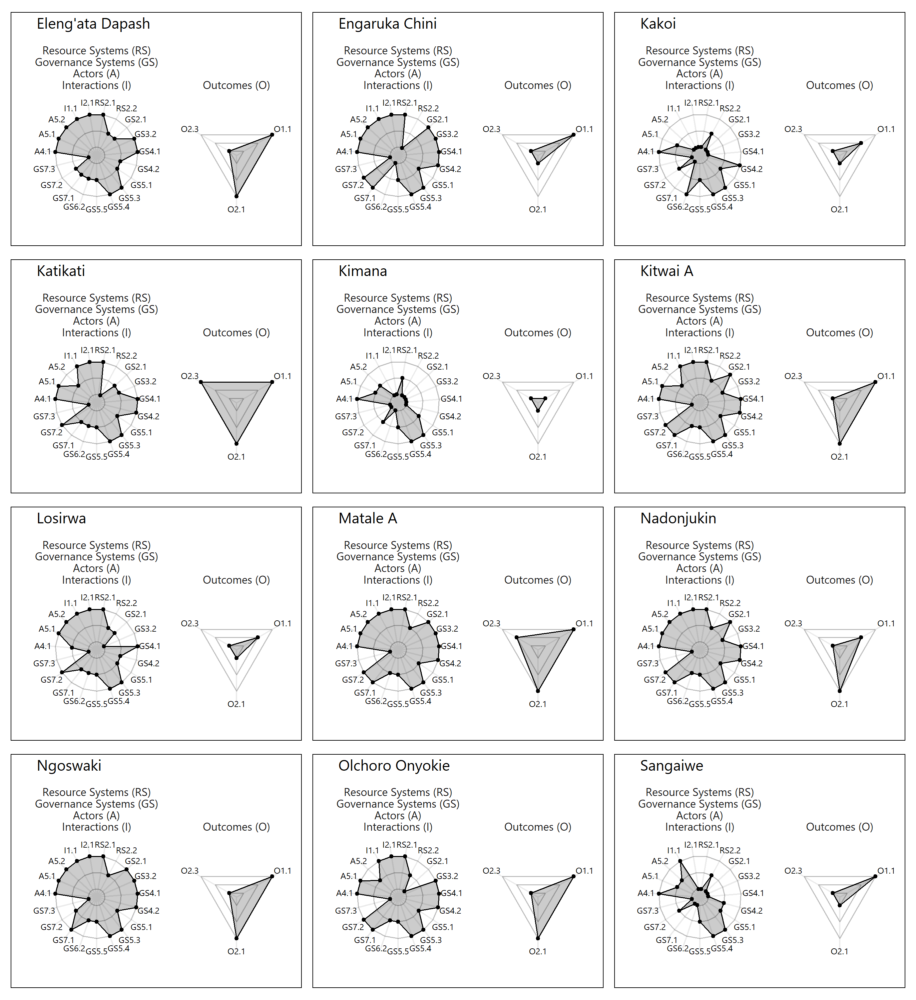
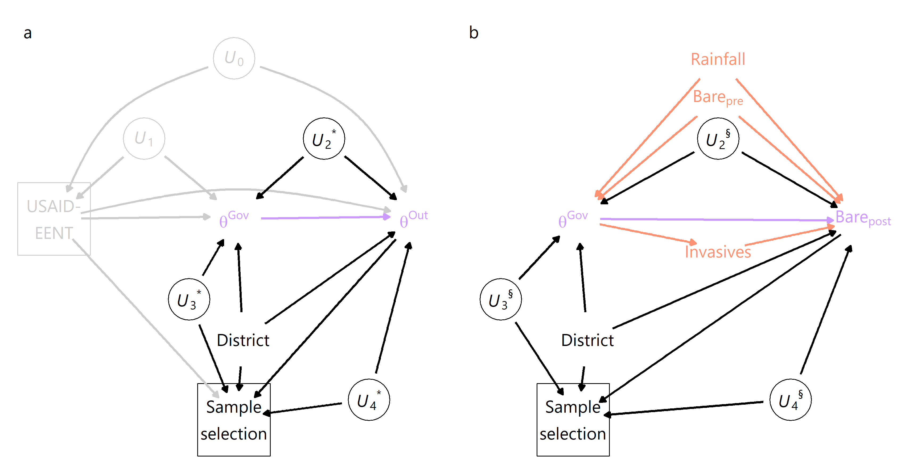

# evaluatordilemma

This repository contains data and analysis code to reproduce results from the article **"Towards a Methodological Toolkit to Mitigate the Evaluator’s Dilemma: Assessing Pastoralist Rangelands Management in Northern Tanzania"**.

<body> 
 

 
   
   
   

 
 
</body> 

 

All data is stored in `/data`. The script `R/compute_results.R` loads these data and computes all results (fitting models, creating tables and figures, ...), also sourcing the custom funtions in `R/functions.R`. In `R/draw_dags.R`, the causal graphs shown in the article are drawn. The R Markdown script `rmarkdown_tableknittig/knit_model_tables.Rmd` formats tables with model parameters estimates as `.docx` file for MS Word.

In the folder `/data/satellite_raw`, raw data from remote sensing sources and village polygons are stored. The analysis script does not import these files and uses instead the processed data files in `/data`, which contain the relevant information in tabular form.

 

**Version info:**

R session info (from `R/compute_results.R`) can be accessed <a href="sessionInfo.txt">here</a>. MCMC sampling was conducted via the `cmdstan` backend `v2.35.0`.
