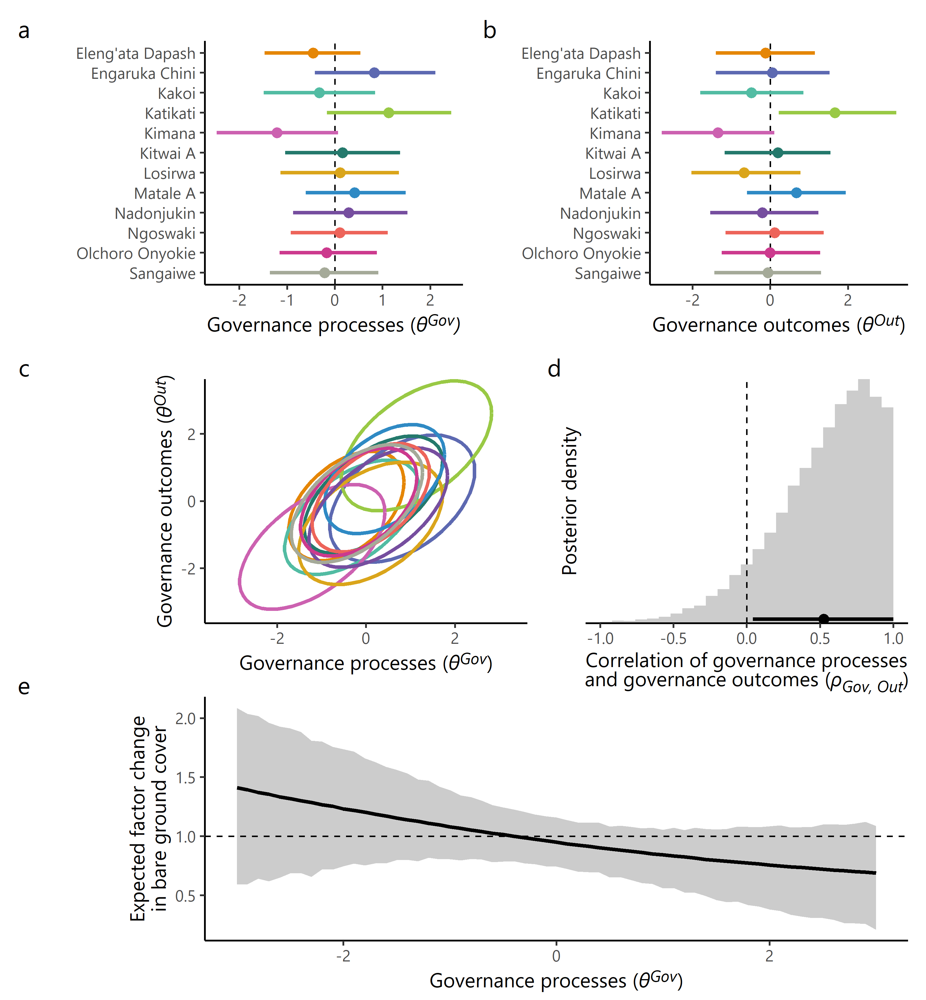

# evaluatordilemma

This repository contains data and analysis code to reproduce results from the article **"Towards a Methodological Toolkit to Mitigate the Evaluator’s Dilemma: a Case Study of Pastoralist Communal Rangelands Management"**.

<body> 
 

 
   
   
   

 
 
</body> 

 

All data is stored in `/data`. The script `R/compute_results.R` loads these data and computes all results (fitting models, creating tables and figures, ...), also sourcing the custom funtions in `R/functions.R`. In `R/draw_dags.R`, the causal graphs shown in the article are drawn.

The RMarkdown script `rmarkdown_tableknittig/knit_model_tables.Rmd` formats tables with model parameters estimates as `.docx` file for MS Word (but note that `R/compute_results.R` must have been run before, as it exports the required `.rds` files).

 

**R session info:** (from `R/compute_results.R`): <a href="sessionInfo.txt">Here</a>
